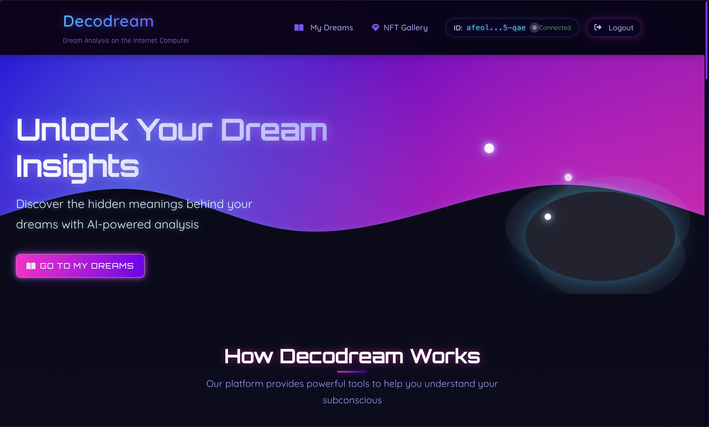

# Decodream
An IC-blockchain-based platform that transforms dreams into digital art using AI technology.


## Description
Decodream reimagines how dreams are explored and expressed through digital art and blockchain technology. Users can submit their dreams, receive AI-driven interpretations, and transform them into unique digital artworks. Built on the Internet Computer blockchain, Decodream ensures privacy and security for all user data.

### Key Features:
1. **Dream Interpretation** - Users submit dream descriptions that are analyzed by an AI interpretation engine.
   * **Semantic Analysis** - Extracts key themes and emotions.
   * **Personalized Insights** - Provides meaningful interpretations.
2. **AI Image Generation** - Dream interpretations are converted into digital artwork.
3. **NFT Minting & Dream Sharing**
   * Users can mint dream-inspired artwork as NFTs.
   * Option to share dream entries publicly or keep them private
   * Create a personal public NFT gallery or keep a private collection.

## Made by DAOist Warriors Team
1. **Kimsang Silalahi** - Visionary Team Leader
2. **Gilberdi Sinaga** - Web3 & AI Orchestrator
3. **Haikal Rahman** - Immersive UI/UX Artisan

## Getting Started

### Dependencies
- [NodeJS 20+](https://nodejs.org/en/download/)
- [Internet Computer dfx CLI](https://internetcomputer.org/docs/current/developer-docs/setup/install/)
- [Visual Studio Code](https://code.visualstudio.com/Download) (recommended)

```bash
sh -ci "$(curl -fsSL https://internetcomputer.org/install.sh)"
```

### Installation
```bash
git clone https://github.com/sngbd/decodream
cd decodream
```

### Running the Application
```bash
dfx start --clean --background
dfx deploy
cd src/workers-ai-wrapper
sudo chmod +x run.sh
./run.sh
```

The frontend will be available at: http://[frontend-canister-id].localhost:4943

### Stopping the Server
```bash
dfx stop
```

## Notes
- Decodream is built on the Internet Computer (IC) blockchain for privacy and security.
- The platform integrates:
  1. **DeepSeek: R1 Distill Llama 70B** ([Docs](https://openrouter.ai/deepseek/deepseek-r1-distill-llama-70b:free)) for dream analysis.
  2. **Stable Diffusion XL-base-1.0** ([Docs](https://developers.cloudflare.com/workers-ai/models/stable-diffusion-xl-base-1.0/)) for dream-based image generation.
- Environment variables required:

#### Main Application (.env)
```
VITE_DEEPSEEK_API_KEY=your-deepseek-api-key-here
```

#### AI Worker (.env in `src/workers-ai-wrapper`)
```
CLOUDFLARE_ACCOUNT_ID=your-cloudflare-account-id-here
CLOUDFLARE_API_TOKEN=your-cloudflare-api-token-here
```

## Version History
* **0.1** - Initial release for Hackathon 11.

## License
This project is licensed under the DAOist Warriors License - see LICENSE.md for details.

